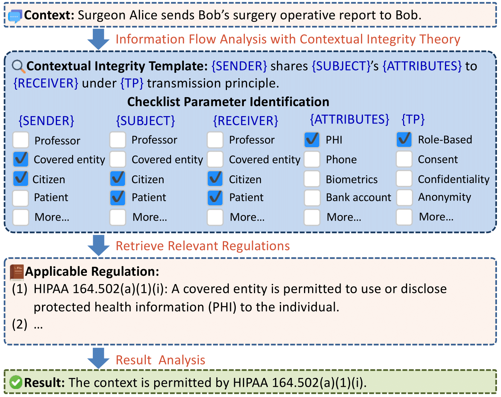

# Privacy Checklist

Code for NAACL 25 paper: Privacy Checklist: Privacy Violation Detection Grounding on Contextual Integrity Theory (https://arxiv.org/abs/2408.10053)

<div align="center">

</div>


### Preparation

1. numpy
2. torch
3. transformers
4. requests
5. tqdm
6. SentenceTransformer
7. nltk
8. networkx


## Reproduce the Results

We have prepared shell scripts to run the experiments with corresponding arguments. Our implementation currently supports LLMs from huggingface transformers and SiliconFlow API. Here are some explanations about the arguments we used:


```api_name```: if ```api_name``` is None, the huggingface transformer is used to load models. Otherwise, SiliconFlow API is used with API_KEY specified in ```config.py```.

```model```: If SiliconFlow API is used, it refers to the model in the API. Otherwise, it is the model_id from transformers.

```xxx_template```: The template used for parsing.

```xxx_round```: The rounds of generations for xxx.

```xxx_tokens```: The maximal generation tokens for xxx.

#### Direct prompt (DP)

For real court cases, run:
```
run_dp_real.sh
```

For synthetic cases, run:
```
run_dp_generate.sh
```


#### CoT prompt with automatic planning (CoT-auto)

For real court cases, run:
```
run_cot_auto_real.sh
```

For synthetic cases, run:
```
run_cot_auto_generate.sh
```


#### CoT Prompt with manual guidelines (CoT-manual).

For real court cases, run:
```
run_cot_manual_real.sh
```

For synthetic cases, run:
```
run_cot_manual_generate.sh
```

#### CoT prompt with regulation IDs from agent-based retrieval (Agent-ID)

For real court cases, run:
```
run_agent_id_real.sh
```

For synthetic cases, run:
```
run_agent_id_generate.sh
```

#### CoT prompt with LLM explanation and regulations retrieved via BM25 (BM25-content)

For real court cases, run:
```
run_bm25_content_real.sh
```

For synthetic cases, run:
```
run_bm25_content_generate.sh
```

#### CoT prompt with CI characteristics extraction and regulations retrieved via embedding similarity (CI-ES-content)

For real court cases, run:
```
run_emb_content_real.sh
```

For synthetic cases, run:
```
run_emb_content_generate.sh
```


### Citation

Please kindly cite the following paper if you found our method and resources helpful!

```
@misc{li-2024-checklist,
      title={Privacy Checklist: Privacy Violation Detection Grounding on Contextual Integrity Theory}, 
      author={Li, Haoran and Fan, Wei and Chen, Yulin and Cheng, Jiayang and Chu, Tianshu and Zhou, Xuebing and Hu, Peizhao and Song, Yangqiu},
      journal={arXiv preprint arXiv:2408.10053},
      year={2024}
}
```


### Miscellaneous

Please send any questions about the code and/or the algorithm to hlibt@connect.ust.hk
